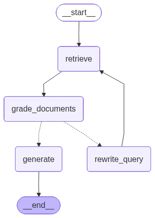
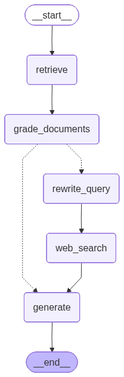

# self-correcting-research-assistant

A RAG agent that **grades its own retrieved documents** and triggers corrective retrieval when context quality is low.

**Two variants:**
- **Variant 1 (PDF-Only):** retrieve → grade → if bad, rewrite query → re-retrieve (1 retry) → generate
- **Variant 2 (Web Fallback):** retrieve → grade → if bad, rewrite query → DuckDuckGo search → generate

<table>
  <tr>
    <th>Variant 1: PDF-Only</th>
    <th>Variant 2: Web Fallback</th>
  </tr>
  <tr>
    <td>
      
    </td>
    <td>
      
    </td>
  </tr>
</table>
